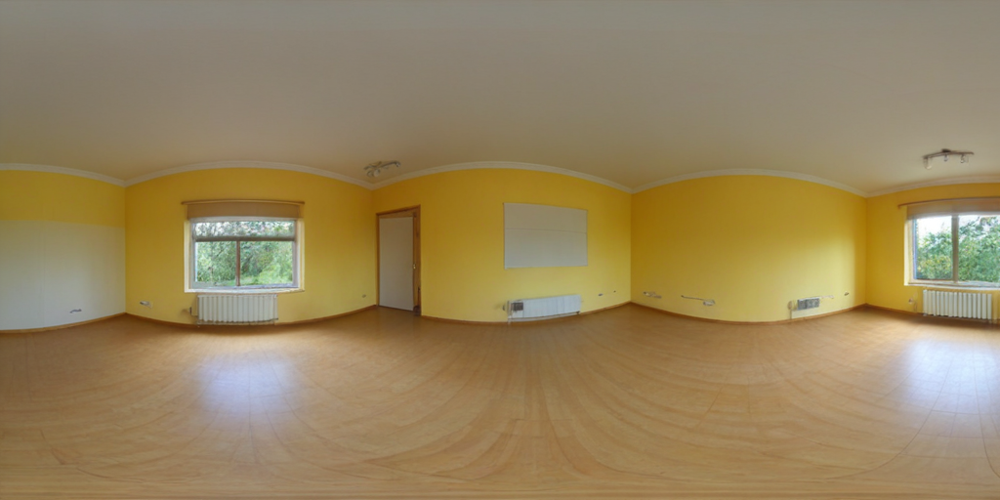
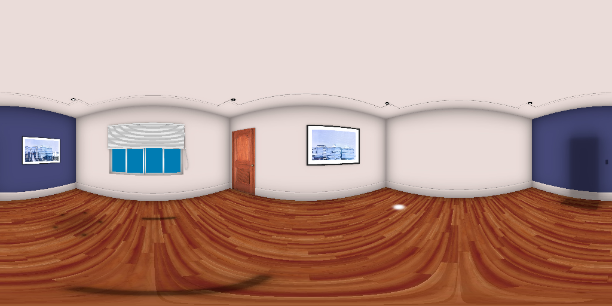
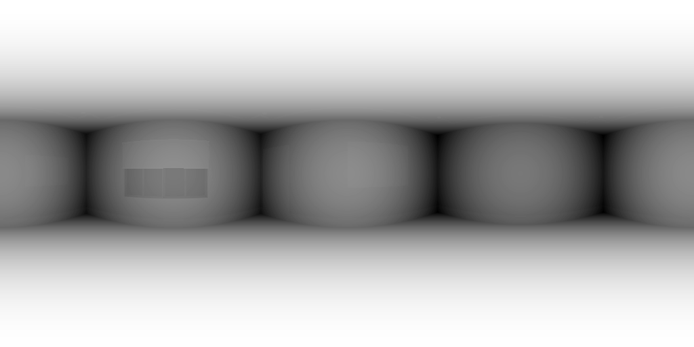

## Coherent_Panorama_SD
Generating coherent 360-panorama from depth conditioning using Stable diffusion model

## Problem statement:
Using generative AI model to produce 360 Panoramic output that is seamless and coherent. And it also needs to follow a depth prior.
| Incoherent | Coherent | Given depth map |
|--------|----------|---------------------------|
|  |  |  |

## Installation:

Clone this repository

```bash
git clone https://github.com/kanishkanms/Coherent_Panorama_SD.git
cd Coherent_Panorama_SD
```

Installing necessary libraries

```bash
pip install diffusers==0.19.2 transformers accelerate safetensors huggingface_hub
git clone https://github.com/replicate/cog-sdxl cog_sdxl
```

## Files

- **part_1.py**: Produces Coherent 360 Panorama based on just the text prompt
- **part_2.py**: Produces Coherent 360 Panorama based on text prompt and depth conditioning
- **pano_depth.png** : Depth map image

### Modifying prompt:

Line 58 of **part_1.py** and Line 69 of **part_2.py** can be modified to change the text prompt

## Thought process:

**Seamless Panorama (Part-1)** \
To develop a seamless 360 panorama, the convolution layers of the Stable diffusion model are modified to circular padding. 
This thread https://github.com/huggingface/diffusers/issues/556 was really helpful in understanding the underlying problem and coming up with a solution to the same.

*This below implementation worked only with **diffusers==0.19.2** and below, for newer versions, this implementation did not work*

The below function is used to pad a single convolution layer asymmetrically along x-axis only. Lines [10-17](part_1.py#L10-L17).
```python
# Define asymmetric convolution function for model customization
def asymmetricConv2DConvForward(self, input: Tensor, weight: Tensor, bias: Optional[Tensor]):
    """Performs asymmetric convolution with circular padding on the horizontal axis."""
    self.paddingX = (self._reversed_padding_repeated_twice[0], self._reversed_padding_repeated_twice[1], 0, 0)
    self.paddingY = (0, 0, self._reversed_padding_repeated_twice[2], self._reversed_padding_repeated_twice[3])
    working = F.pad(input, self.paddingX, mode='circular')  # Wrap elements around horizontally
    working = F.pad(working, self.paddingY, mode='constant')  # Extend edges vertically
    return F.conv2d(working, weight, bias, self.stride, _pair(0), self.dilation, self.groups)
```

The below code collects layers from the **VAE**, **UNET** within the model pipe, and overrides their conv2D Forward method, with the above asymmetric convolution. Lines [26-41](part_1.py#L26-L41).

```Python
# Disable tiling for potential efficiency gains
pipe.vae.use_tiling = False

# Modify model architecture for asymmetric convolution and LoRA compatibility
targets = [pipe.vae, pipe.text_encoder, pipe.unet]  # Target modules for modification
conv_layers = []  # Collect convolution layers for modification
for target in targets:
    for module in target.modules():
        if isinstance(module, torch.nn.Conv2d):
            conv_layers.append(module)

for cl in conv_layers:
    if isinstance(cl, diffusers.models.lora.LoRACompatibleConv) and cl.lora_layer is None:
        cl.lora_layer = lambda *x: 0  # Initialize placeholder LoRA layer if needed

    cl._conv_forward = asymmetricConv2DConvForward.__get__(cl, torch.nn.Conv2d)  # Replace forward method
```
**Seamless Panorama with Depth prior (Part-2)**
Along with above implementation, now we add a controlnet to this pipeline that adds the depth condition necessary in this scenario. Lines [20-26](part_2.py#L20-L26).
```Python
# Load ControlNet and Stable Diffusion XL pipeline with optimizations
controlnet = ControlNetModel.from_pretrained(
    "diffusers/controlnet-depth-sdxl-1.0-mid",
    variant="fp16",
    use_safetensors=True,
    torch_dtype=torch.float16,
).to("cuda")
```
And slight modification in the inference stage, where we attach the prior image and controlnet_conditioning_scale to the pipe. Lines [66-75](part_1.py#L66-L75).
```Python
image = load_image("/content/pano_depth.png")  # Load depth image
controlnet_conditioning_scale = 0.5  # Recommended for good generalization
images = pipe(
    prompt,
    image=image,
    controlnet_conditioning_scale=controlnet_conditioning_scale,
    cross_attention_kwargs={"scale": 0.8},
).images
```

## Results:

| Prompt | Panorama | Panorama with Depth Prior |
|--------|----------|---------------------------|
| hdri view, japanese bedroom in the color of blue |  |  |
| Another Prompt |  |  |
| ...    | ...      | ...                       |

